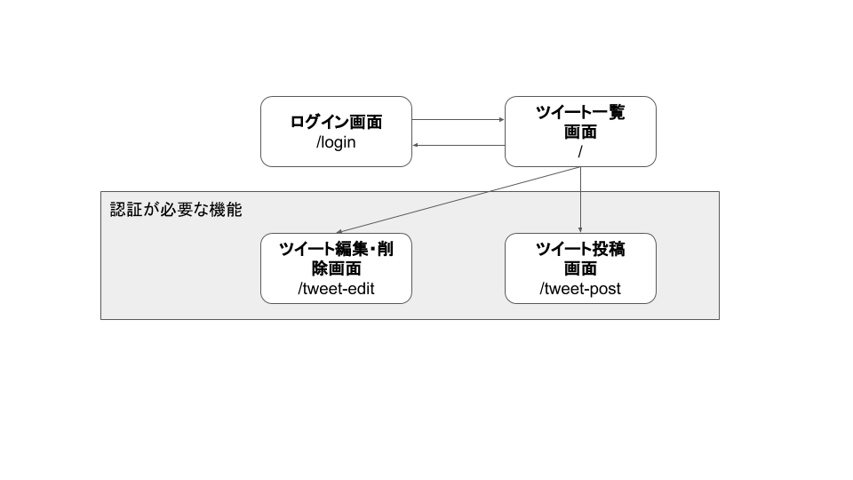

# Java Servlet 演習課題

認証機能付きのツイートアプリを作成します。
機能一覧と、画面遷移図は以下のようになります。

- 機能一覧

| 機能名 | 概要 |
| --- | --- |
| ログイン | 指定されたメールアドレスとパスワードでログインすることができる。 |
| ログアウト | 現在ログインしているユーザーをログアウトする。 |
| ツイート一覧表示 | 投稿されているツイートを日付が新しい順に表示する。 |
| ツイート投稿 | ログインしているユーザーが新しいツイートを投稿する。 |
| ツイート編集 | ログインしているユーザーが、ユーザー自身が投稿したツイートを編集する。 |
| ツイート削除 | ログインしているユーザーが、ユーザー自身が投稿したツイートを削除する。 |

- 画面遷移図



## データベース作成

以下のテーブル定義書をもとにデータベースを作成してください。データベース名は独自で決定してください。

- USERSテーブル

| 論理名 | 物理名 | データ型 | PK | NN | FK | その他制約 |
| --- | --- | --- | --- | --- | --- | --- |
| ユーザーID | ID | INT | 〇 | | | AUTO_INCREMENT |
| メールアドレス | EMAIL | VARCHAR(255) | | 〇 | | UNIQUE |
| パスワード | PASSWORD | VARCHAR(64) | | 〇 | |  |
| 名前 | NAME | VARCHAR(64) | | 〇 | |  |

- TWEETテーブル

| 論理名 | 物理名 | データ型 | PK | NN | FK | その他制約 |
| --- | --- | --- | --- | --- | --- | --- |
| ID | ID | INT | 〇 | | | AUTO_INCREMENT |
| タイトル | TITLE | VARCHAR(64) | | 〇 | |  |
| 本文 | BODY | VARCHAR(255) | | 〇 | |  |
| 投稿者ID | USER_ID | INT | | 〇 | USERS.ID |  |
| 投稿日 | UPDATE_AT | TIMESTAMP | | 〇 | |  |


## 初期データ登録

データベースに初期データを登録します。各テーブルに、以下の表の初期データを作成してください。

- USERSテーブル

| ID | EMAIL | PASSWORD | NAME |
| --- | --- | --- | --- |
| 1 | user1@okatter.com | user1 | User First |
| 2 | user2@okatter.com | user2 | User Second |
| 3 | user3@okatter.com | user3 | User Third |

- TWEETテーブル

| ID | TITLE | BODY | USER_ID | UPDATE_AT |
| --- | --- | --- | --- | --- |
| 1 | 今日の天気 | 今日は晴れてとても暑いです。 | 1 | `現在日時` |
| 2 | 今日のお昼ご飯 | 今日はお昼にうどんを食べました。 | 1 | `現在日時` |
| 3 | 明日の予定 | 明日は朝から大事な会議があります。 | 3 | `現在日時` |

### プロジェクトの作成

Eclipseで動的Webプロジェクトを作成します。プロジェクト名は独自で決定してください。作成したプロジェクトの「WebContent -> WEB-INF -> lib」フォルダには以下のJARファイルを追加します。

- mysql-connector-java-5.1.46.jar
- taglibs-standard-impl-1.2.5.jar
- tablibs-standard-spec-1.2.5.jar

次にJavaリソース配下のsrcファルダ内に、「com.`プロジェクト名`」のパッケージを作成し、今後の作業パッケージとします。

作成したパッケージ直下に`DataSourceManager.java`を作成し、以下のように実装してくだしさい。

```java
public class DataSourceManager {

	public static Connection getConnection() throws SQLException, NamingException {
		Context context = new InitialContext();
		DataSource dataSource = (DataSource) context.lookup("java:comp/env/jdbc/mysql");
		return dataSource.getConnection();
	}
}
```

さらにTomcatの設定ファイル「server.xml」に以下のようにDataSourceの設定を追加します。

```
<Context docBase="プロジェクト名" path="/プロジェクト名" reloadable="true" source="org.eclipse.jst.jee.server:プロジェクト名">
  	<Resource name="jdbc/mysql"
		auth="Container" type="javax.sql.DataSource"
		driverClassName="com.mysql.jdbc.Driver"
		url="jdbc:mysql://localhost:3306/データベース名?useSSL=false"
		username="ユーザー名" password="パスワード"
		maxTotal="30" maxIdle="10" maxWaitMillis="5000" />
</Context>
```


プロジェクトのセットアップが完了したら、以下の順に課題を進めていいきましょう。


1. [ツイート一覧機能](./list.md)

2. [ログイン機能・ログアウト機能](./login.md)

3. ツイート投稿機能

4. ツイート編集機能

5. ツイート削除機能
