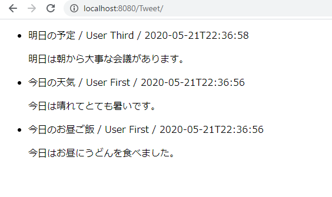

# ツイート一覧機能

以下のようなツイート一覧画面を作成します。



以下の要件を満たすこと。

- 画面には、投稿日付が新しい順にツイートを表示する。
- ツイートを表示する際は、1行名は「"ツイートのタイトル" / "投稿者の名前" / "投稿日時"」を、2行目にはツイートの本文を表示します。

## TweetDto.javaの作成

以下のようなフィールドを持つ、`TweetDto.java`を作成し、それぞれsetterメソッドとgetterメソッドを作成してください。

| フィールド名 | 概要 | 型 | アクセス修飾子 |
| --- | --- | --- | --- |
| id | ツイートID | int | private |
| title | タイトル | String | private |
| body | 本文 | String | private |
| userId | 投稿者ID | int | private |
| postName | 投稿者名 | String | private |
| updateAt | 投稿日時 | LocalDateTime | private |

## TweetDao.javaの作成

以下のような、フィールド、コンストラクタ、メソッドを持つ`TweetDao.java`を作成してください。
`selectAll`メソッドは登録されているツイートの一覧を投稿日が新しい順に取得し、さらに各ツイートの投稿者の名前も取得すること。

- フィールド

| フィールド名 | 概要 | 型 | アクセス修飾子 |
| --- | --- | --- | --- |
| connection | コネクションクラス | java.sql.Connection | protected |

- コンストラクタ

| 引数 | 概要 | アクセス修飾子 |
| --- | --- | --- |
| java.sql.Connection | フィールドにConnectionクラスを設定する | public |

- メソッド

| メソッド名 | 概要 | 引数 | 戻り値 |
| --- | --- | --- | --- |
| selectAll | 登録されているツイートの一覧を投稿日が新しい順に取得する | なし | List<TweetDto> |

`selectAll`メソッドの実装は以下を参考にしてください。

```java
	public List<TweetDto> selectAll() throws SQLException{
		StringBuilder sb = new StringBuilder();
		// SQLを組み立てる
		sb.append("SELECT");
		sb.append(" ???");
		sb.append(" ,???");
		sb.append(" ,???");
		sb.append(" ,???");
		sb.append(" ,???");
		sb.append(" ,???");
		sb.append(" FROM TWEET");
		sb.append(" INNER JOIN ???");
		sb.append(" ON ??? = ???");
		sb.append(" ORDER BY ??? ???");

		List<TweetDto> allTweet = new ArrayList<>();

		try(PreparedStatement ps = connection.prepareStatement(sb.toString())){
			ResultSet rs = ps.???();

			while(rs.next()) {
				TweetDto dto = new TweetDto();
				dto.setId(rs.getInt("???"));
				dto.setTitle(rs.getString("???"));
				dto.setBody(rs.getString("???"));
				dto.setUserId(rs.getInt("???"));
				dto.setPostName(rs.getString("???"));
				dto.setUpdateAt(rs.getTimestamp("???").toLocalDateTime());
				allTweet.add(dto);
			}
			return allTweet;
		}
	}
```

## TweetServlet.javaの作成

以下の要件を満たす、ツイート一覧を表示する`TweetServlet.java`サーブレットを作成します。

| URL | メソッド | フォワード先 |
| --- | --- | --- |
| / | GET | list-tweet.jsp |

以下を参考に作成して下さい。

```java
@WebServlet("???")
public class TweetServlet extends HttpServlet{

	@Override
	protected void doGet(HttpServletRequest req, HttpServletResponse resp) throws ServletException, IOException {
		try(Connection con = DataSourceManager.getConnection()){
			??? dao = new ???(con);
			List<TweetDto> allTweet = dao.???();

			req.setAttribute("allTweet", allTweet);

			req.getRequestDispatcher("???").forward(req, resp);
		} catch (SQLException | NamingException e) {
			// TODO 自動生成された catch ブロック
			e.printStackTrace();
		}
	}
}
```

## list-tweet.jspの作成

取得したツイート一覧を表示する`list-tweet.jsp`を、「WEB-INF」フォルダ配下に作成します。

以下を参考に作成してください。

```
<%@ page language="java" contentType="text/html; charset=UTF-8" pageEncoding="UTF-8"%>
<%@ taglib prefix="c" uri="http://java.sun.com/jsp/jstl/core"%>
<!DOCTYPE html>
<html>
<head>
<meta charset="UTF-8">
<title>"プロジェクト名"</title>
</head>
<body>
	<ul>
		<c:forEach items="${???}" var="tweet">
			<li>
				<p>
					<c:out value="${tweet.???}"/> / <c:out value="${tweet.???}"/> / <c:out value="${tweet.???}"/>
				</p>
				<p><c:out value="${tweet.???}" /></p>
			</li>
		</c:forEach>
	</ul>
</body>
</html>
```


以上のファイルを作成し、サーバーを再起動して、`http://localhost:8080/プロジェクト名/`にアクセスして動作を確認してください。