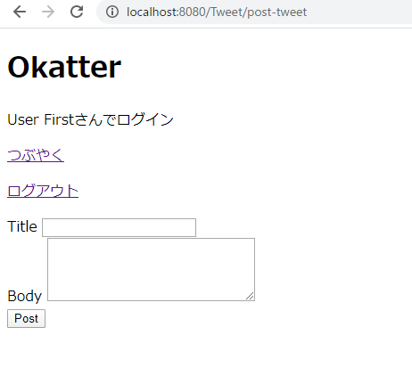

# ツイート投稿機能

ログインしているユーザーがヘッダーの「つぶやく」リンクを押下すると、ツイート投稿画面に遷移しツイートを投稿できるようにします。
以下のような投稿画面を作成します。



## TweetDao.javaにメソッドを追加

データベースに新しいツイートを投稿する`insertTweet`メソッドを作成します。

| メソッド名 | 概要 | 引数 | 戻り値 |
| --- | --- | --- | --- |
| insertTweet | Dtoをもとに新しいツイートをデータベースに登録する | int | TweetDto |

以下を参考に実装してくだしさい。

```java
	public int insertTweet(TweetDto dto) throws SQLException {
		StringBuilder sb = new StringBuilder();
		// SQLを組み立てる
		???

		try(PreparedStatement ps = connection.prepareStatement(sb.toString())){
			ps.setString(1, dto.getTitle());
			ps.setString(2, dto.getBody());
			ps.setInt(3, dto.getUserId());
			ps.setTimestamp(4, Timestamp.valueOf(dto.getUpdateAt()));

			return ps.executeUpdate();
		}
	}
```

## TweetPostServlet.javaの作成

ツイート投稿画面を表示し、ツイートを投稿する`TweetPostServlet.java`を作成します。
ログインしているユーザーのみがアクセスすることができるようにすること。

| URL | メソッド | フォワード・リダイレクト先 |
| --- | --- | --- |
| /post-tweet | GET | ・ログインしている場合 → post.jsp <br>・ログインしていない場合 → ツイート一覧表示のURLにリダイレクトp |
| /post-tweet | POST | ・ログインしている場合 → ツイートを登録し、ツイート一覧表示のURLにリダイレクト <br>・ログインしていない場合 → ツイート一覧表示のURLにリダイレクト |

以下を参考に作成して下さい。

```java
@WebServlet("/???")
public class TweetPostServlet extends HttpServlet{

	@Override
	protected void doGet(HttpServletRequest req, HttpServletResponse resp) throws ServletException, IOException {
		HttpSession session = req.getSession(true);
		???

		if(???) {
			resp.sendRedirect(req.getContextPath() + "/");
			return;
		}
		req.getRequestDispatcher("/WEB-INF/post.jsp").forward(req, resp);
	}

	@Override
	protected void doPost(HttpServletRequest req, HttpServletResponse resp) throws ServletException, IOException {

		HttpSession session = req.getSession(true);
		???

		if(???) {
			resp.sendRedirect(req.getContextPath() + "/");
			return;
		}

		req.setCharacterEncoding("???");
		String title = req.getParameter("???");
		String body = req.getParameter("???");
		TweetDto dto = new TweetDto();
		dto.setTitle(title);
		dto.setBody(body);
		dto.setUserId(user.getId());
		dto.setUpdateAt(LocalDateTime.now());

		try(Connection connection = DataSourceManager.getConnection()){
			TweetDao dao = new TweetDao(connection);
			dao.???(???);

			resp.sendRedirect(req.getContextPath() + "/");
		} catch (SQLException | NamingException e) {
			// TODO 自動生成された catch ブロック
			e.printStackTrace();
		}
	}
}
```

## post.jspの作成

ツイートを新規投稿する`post.jsp`を、「WEB-INF」フォルダ配下に作成します。

以下を参考に実装してくだしさい。

```
<%@ page language="java" contentType="text/html; charset=UTF-8" pageEncoding="UTF-8"%>
<%@ taglib prefix="c" uri="http://java.sun.com/jsp/jstl/core"%>
<!DOCTYPE html>
<html>
<head>
<meta charset="UTF-8">
<title>Okatter</title>
</head>
<body>

	<%@ include file="./???.jsp" %>

	<form action="???" method="???">
		<div>
			<label>Title</label>
			<input type="???" name="???">
		</div>
		<div>
			<label>Body</label>
			<textarea rows="5" cols="30" name="???"></textarea>
		</div>
		<div>
			<button type="submit">Post</button>
		</div>
	</form>

</body>
</html>
```

以上のファイルを作成し、サーバーを再起動して、ツイートを新規投稿できるかを確認してください。
